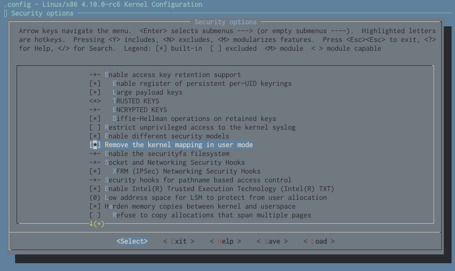

# KAISER: Kernel Address Isolation to have Side-channels Efficiently Removed

This repository contains our implementation of KAISER, a kernel isolation technique to close hardware side channels on kernel address information.

The patch has been developed on top of version ``4.10-rc6`` of the Linux kernel, but can be maybe applied to more recent versions as well.
However, this has not been tested.

## Table of content

- [Installation](#installation)
- [Preparing the source](#preparing-the-source)
- [Building](#building)
- [License](#license)

## Installation

You can either install our pre-build [.deb packages](../dist) with the following command, or build your own packages:

    deb -i linux-*-4.10.0-rc6-kaiser_amd64.deb

## Preparing the source

First, you need to download the source of the Linux kernel and checkout the correct version:

    git clone https://github.com/torvalds/linux
    git checkout v4.10-rc6

Then apply our provided patch file:

    git am <KAISER-repo-dir>/KAISER/0001-KAISER-Kernel-Address-Isolation.patch

## Building

### Kernel configuration

To build the Linux kernel, the correct configuration has to be applied.
You can either use the minimal configuration (Run ``make x86_64_defconfig``) or the one that your Ubuntu system currently uses.
To use the currently used one, copy `` /boot/config-`uname -r` `` to ``.config``.

### Enable KAISER

In order to enable KAISER, add `CONFIG_KAISER=y` to your
``.config`` file or by executing

    make menuconfig

and selecting ``Remove the kernel mapping in user mode`` in the ``Security options``.

### Build kernel

You can now build the kernel by running

    make -j `getconf _NPROCESSORS_ONLN`

### Building .deb packages

In addition you can create ``.deb`` packages automatically:

    make -j `getconf _NPROCESSORS_ONLN` deb-pkg LOCALVERSION=-kaiser

## License

[Licensed](../LICENSE) under the 3-clause BSD license.
